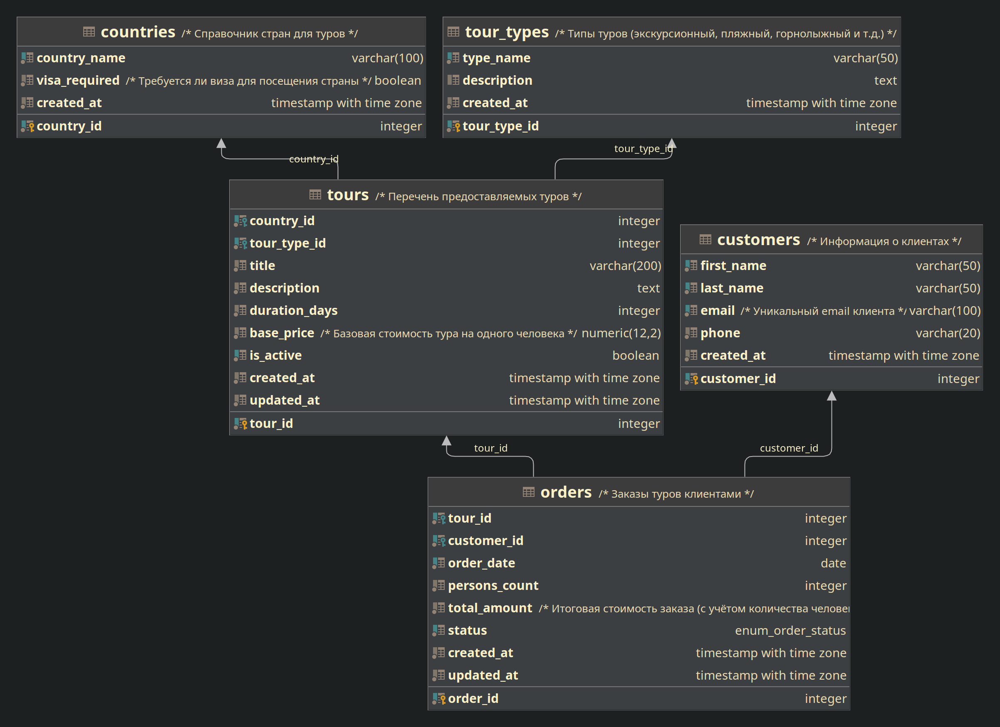

# База данных "Туризм"

Учебный проект базы данных для системы управления турагентством.

## ER-диаграмма

## Структура базы данных

### Таблицы
- **countries** - справочник стран
- **tour_types** - типы туров
- **customers** - клиенты
- **tours** - перечень туров
- **orders** - заказы клиентов

### Связи
- orders → tours (внешний ключ)
- orders → customers (внешний ключ) 
- tours → countries (внешний ключ)
- tours → tour_types (внешний ключ)
